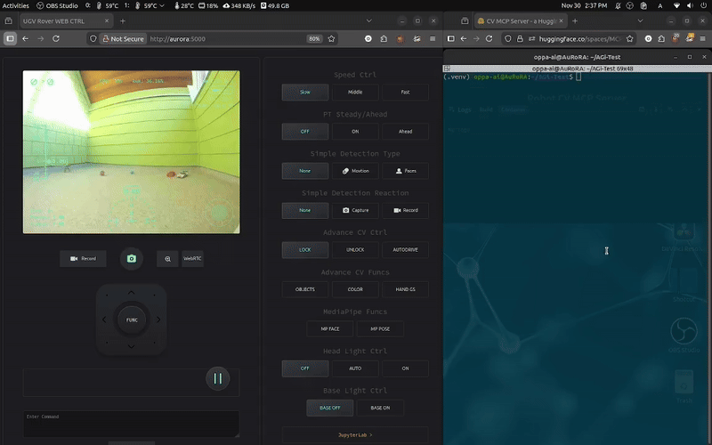

# CV_Robot_MCP

Utilize the VLM in the [CV_MCP_Server](https://huggingface.co/spaces/MCP-1st-Birthday/CV_MCP_Server) HuggingFace Space to "see" the objects through the camera of the robot.

## Overview

CV_Robot_MCP is a Python-based project designed to enable a robot to visually interpret its environment by integrating Vision-Language Models (VLMs). The system communicates with the [CV_MCP_Server HuggingFace Space](https://huggingface.co/spaces/MCP-1st-Birthday/CV_MCP_Server) to analyze images captured by the robot's camera and provide meaningful object descriptions.

## 🎬 Demo video

🎬 Watch the demo video [here](https://photos.app.goo.gl/guxui1EsdPNoL4mw7)




## Features

- **Vision-Language Model Integration:** Seamlessly connects your robot's camera feed with a VLM via the HuggingFace Space.
- **Python Implementation:** Entirely written in Python for flexibility and ease of customization.
- **Object Recognition:** Identifies and describes objects in the robot's field of view.

## Getting Started

### Prerequisites

- Python 3.10+
- Access to the [CV_MCP_Server HuggingFace Space](https://huggingface.co/spaces/MCP-1st-Birthday/CV_MCP_Server)
- Robot hardware with camera support (optional for testing with sample images)

### Installation

Clone this repository:
```bash
git clone https://github.com/OppaAI/CV_Robot_MCP.git
cd CV_Robot_MCP
```
Install Python requirements:
```bash
pip install -r requirements.txt
```

Generate a HuggingFace token and enter it into the .env file

### Usage

1. Start your robot and ensure the camera is functional.
2. Run the main script to capture images and send them to the CV_MCP_Server:
    ```bash
    python cv_robot.py
    ```
3. View the object descriptions returned by the VLM.

## Configuration

- **Server URL:** Update the HuggingFace Space URL in your code/config files if the endpoint changes.
- **Camera Settings:** Modify resolution, frame rate, or source in your Python scripts as needed.

## Contributing

Contributions are welcome! Please open issues or submit pull requests for feature requests, bugs, or improvements.

## License

This project is licensed under the MIT License. See [LICENSE](LICENSE) for details.

## Acknowledgements

- [CV_MCP_Server HuggingFace Space](https://huggingface.co/spaces/MCP-1st-Birthday/CV_MCP_Server)
- HuggingFace for hosting the VLM deployment
- VLM used in the HF Space: Qwen2.5-VL-7B-Instruct
